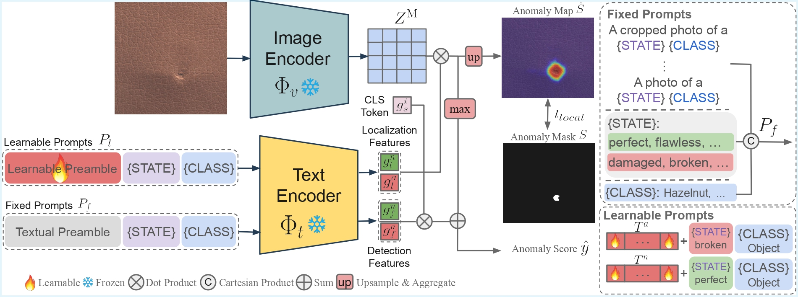
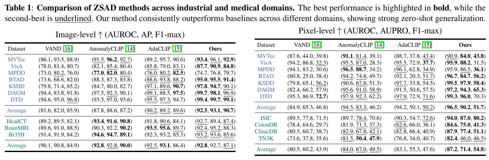
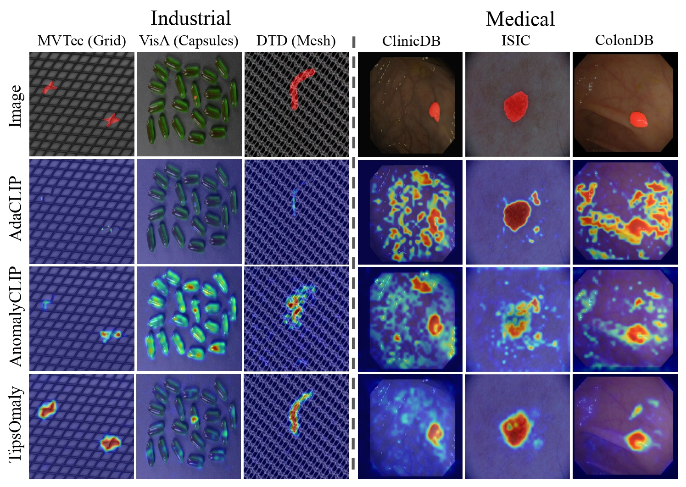

# Tipsomaly (ICASSP 2026)

Official PyTorch implementation of [TIPS Over Tricks: Simple Prompts for Effective Zero-shot Anomaly Detection](https://arxiv.org/abs/2602.03594) — a spatially-aware zero-shot anomaly detection pipeline built on the [TIPS](https://arxiv.org/abs/2410.16512) vision-language model, using decoupled prompts and local evidence injection to improve image-level and pixel-level performance.

---

## Table of Contents

- [📖 Introduction](#-introduction)
- [📊 Results](#-results)
- [🚀 Quickstart](#-quickstart)
- [📍 Checkpoints](#-checkpoints)
- [🔧 Setup](#-setup)
- [🗂️ Datasets](#️-datasets)
- [⚖️ License](#️-license)
<!-- - [🛠️ Training](#️-training) -->
<!-- - [🔗 Citation](#-citation) -->
<!-- - [🙏 Acknowledgements](#-acknowledgements) -->

---

## 📖 Introduction
Anomaly detection identifies departures from expected behavior in safety-critical settings. When target-domain normal data are unavailable, zero-shot anomaly detection (ZSAD) leverages vision-language models (VLMs). However, CLIP's coarse image-text alignment limits both localization and detection due to (i) spatial misalignment and (ii) weak sensitivity to fine-grained anomalies; prior work compensates with complex auxiliary modules yet largely overlooks the choice of backbone. We revisit the backbone and use TIPS-a VLM trained with spatially aware objectives. While TIPS alleviates CLIP's issues, it exposes a distributional gap between global and local features. We address this with decoupled prompts-fixed for image-level detection and learnable for pixel-level localization-and by injecting local evidence into the global score. Without CLIP-specific tricks, our TIPS-based pipeline improves image-level performance by 1.1-3.9% and pixel-level by 1.5-6.9% across seven industrial datasets, delivering strong generalization with a lean architecture.



---

## 📊 Results
Across 14 industrial and medical benchmarks, Tipsomaly consistently outperforms prior CLIP-based zero-shot methods while remaining lightweight. The figure below summarizes its performance across datasets.



We compare pixel-level anomaly maps from Tipsomaly with prior CLIP-based methods (AdaCLIP and AnomalyCLIP) on industrial and medical samples. As shown in the following figure, Tipsomaly more accurately localizes anomalous regions across both domains.



---

## 🚀 Quickstart
**Quick start (recommended):**  
Use our ready-to-run [Kaggle notebook](https://www.kaggle.com/code/sepehrnoey/tipsomaly-reproduction) to reproduce the results with the provided checkpoints.

## 📍 Checkpoints
You can find our checkpoints trained on MVTec and VisA at [this link](https://drive.google.com/file/d/1yvgZYHFljFkGwTD0DYOdrZ_95ZbmjDcC/view?usp=sharing).

---


## 🔧 Setup
To setup the environment and run experiments, follow these steps.
1. Install the required dependencies with the following command.
```
pip install -r requirements.txt
```
2. Download your desired checkpoints of the TIPS model. For this purpose, edit and run the mentioned script to download model components. After downloading the components, place them in a desired directory.
```
bash model/tips/checkpoints/download_checkpoints.sh
```
```
mkdir tips && mv tips_oss_l14_highres_distilled_text.npz tips_oss_l14_highres_distilled_vision.npz tokenizer.model tips/
```
3. Prepare your datasets in the format described in the [Datasets](#️-datasets) section and place them in a desired directory.
```
mkdir data-root && mv mvtec visa data-root/
``` 
4. Now, by setting the correct paths for the model, checkpoints, and the data root path, you can edit the runnable script `reproduce.sh` to run experiments. Here is a sample:
```
models_dir="path/to/tips"
data_root_dir="path/to/data-root"
model_version='l14h' 
checkpoint_path="path/to/checkpoints"

python test.py --models_dir $models_dir --checkpoint_path $checkpoint_path --data_root_dir $data_root_dir --dataset visa --epoch 2 --model_version $model_version --fixed_prompt_type industrial

```

## 🗂️ Datasets
The datasets should be set in the following format. Each dataset, must contain a file named `meta.json` which contains information about the dataset. Common datasets for anomaly detection and instructions to generate `meta.json` files can be found in the [AdaCLIP GitHub repository](https://github.com/caoyunkang/AdaCLIP). The general expected structure of the datasets is like the following:
```
data-root/
├── mvtec/
│   ├── meta.json
│   ├── bottle/
│   │   ├── train/
│   │   │   └── good/
│   │   │       └── 000.png
│   │   ├── test/
│   │   │   ├── good/
│   │   │   │   └── 000.png
│   │   │   ├── broken_large/
│   │   │   │   └── 000.png
│   │   │   └── broken_small/
│   │   │       └── 000.png
│   │   └── ground_truth/
│   │       ├── broken_large/
│   │       │   └── 000_mask.png
│   │       └── broken_small/
│   │           └── 000_mask.png
│
├── visa/
├── mpdd/
├── ....
....
```
<!-- 
## 🛠️ Training

## 🔗 Citation

## 🙏 Acknowledgements -->

## ⚖️ License
This project is licensed under the MIT License. Please refer to the [LICENSE](LICENSE) file for more information.
